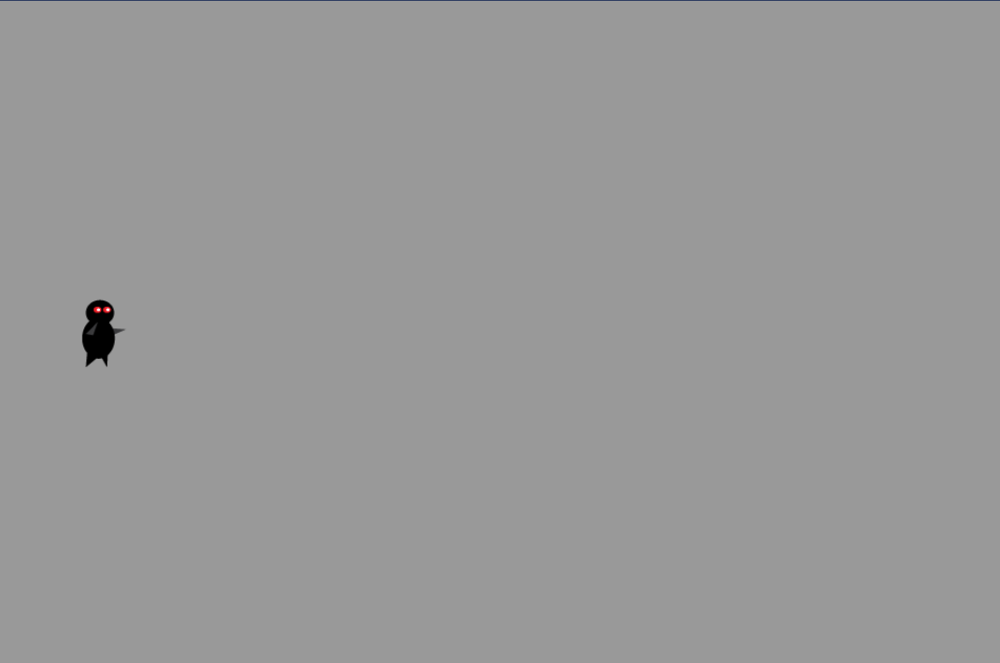
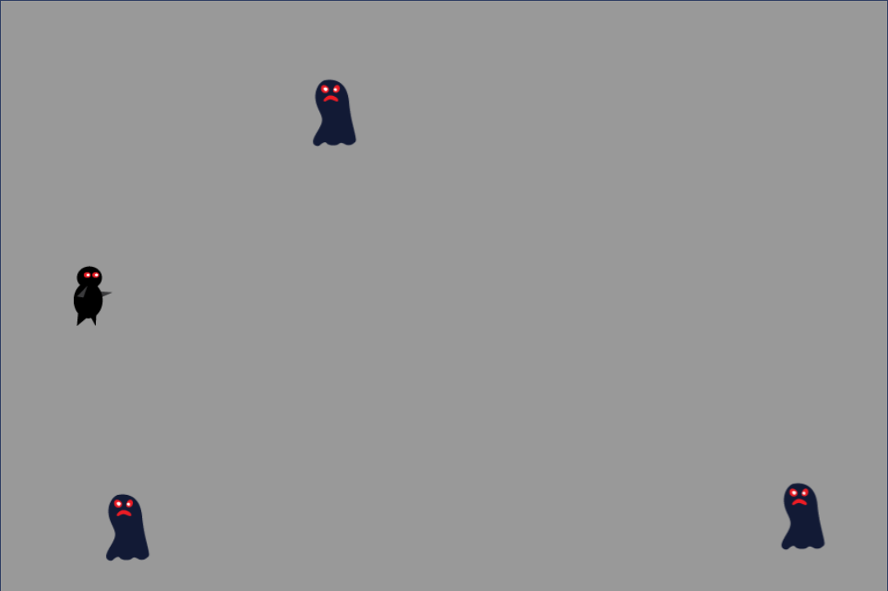
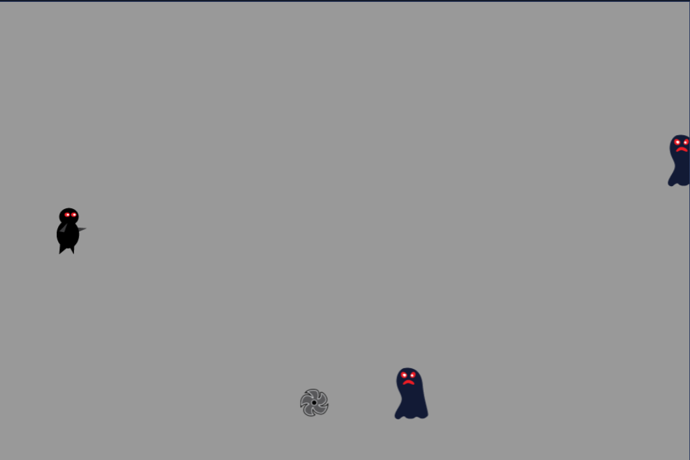
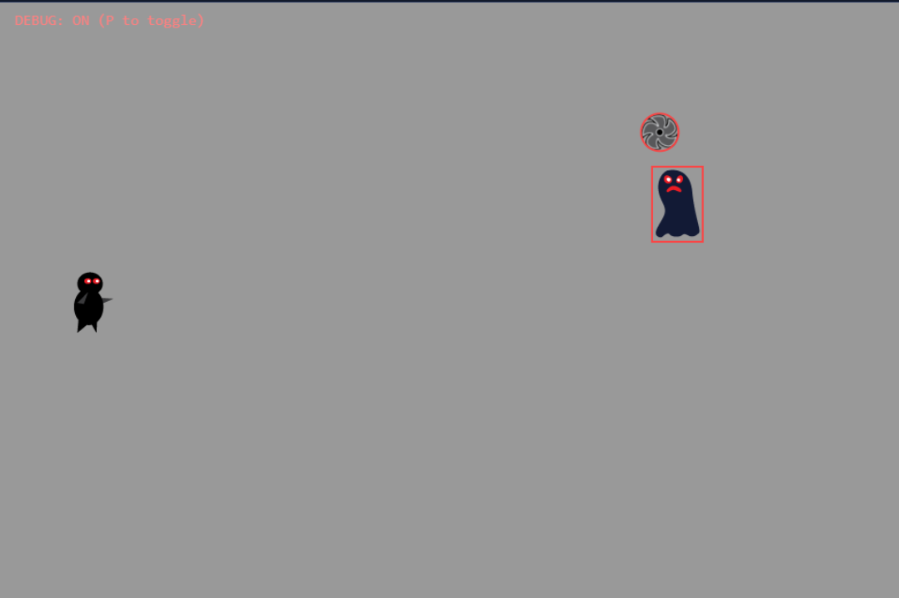

# Ninja Game JS


---

JavaScript/HTML5 Canvas Ninja Game, based on the Kodeco (Ray Wenderlich) Cocos2d-x tutorial, rebuilt as a browser game.

Tutorial source: <https://www.kodeco.com/1848-cocos2d-x-tutorial-for-beginners>

---

## Play Online

- [GitHub Pages](https://joeoregan.github.io/JS-NinjaGame/)

---

## Features

- Monster movement
- Projectile firing
- Collision detection
- Debug mode

---

## Controls

- **Aim:** `Mouse`
- **Fire:** `Right-Click`
- **Debug Toggle:** `P`
- **Music Toggle:** `M`

---

## Tech Stack

- Vanilla JavaScript (ES Modules)
- HTML5 Canvas
- CSS
- Audio via HTMLAudioElement
- Texture atlas + plist parsing

---

## Run Locally

### Option 1: npm (recommended)

```bash
npm install
npm start
```

Then open: <http://127.0.0.1:5500/>

### Option 2: VS Code Live Server

1. Open project in VS Code
2. Run **Live Server** on `index.html`
3. Open in browser

### Option 3: Python static server

```bash
python -m http.server 5500
```

Then open: <http://127.0.0.1:5500/>

---

## Project Structure

```text
assets/
  audio/
    music/
    sfx/
  images/
css/
src/
  audio/
  game.js
  input.js
index.html
package.json
```

---

## Audio Notes

- Background music uses `assets/audio/music/background-music-aac.mp3`.
- Sound effects are loaded from `assets/audio/sfx/`.

---

## Screenshots






---

## Roadmap

- [ ] Sprites
- [ ] Movement
- [ ] Projectiles
- [ ] Collisions and Physics

---

## Related Projects

- [Space Quest JS](https://github.com/JoeORegan/JS-SpaceQuest)
- [Space Game JS](https://github.com/JoeORegan/JS-SpaceGame)
- [Antibody JavaScript](https://github.com/JoeORegan/JS-Antibody)
- [Flappy Bird JavaScript](https://github.com/JoeORegan/JS-FlappyBird)

---

## Credits

- Original tutorial/game design inspiration: Kodeco / Ray Wenderlich Cocos2d-x Ninja Game tutorial
- Original C++ versions from Platform Game Development work
